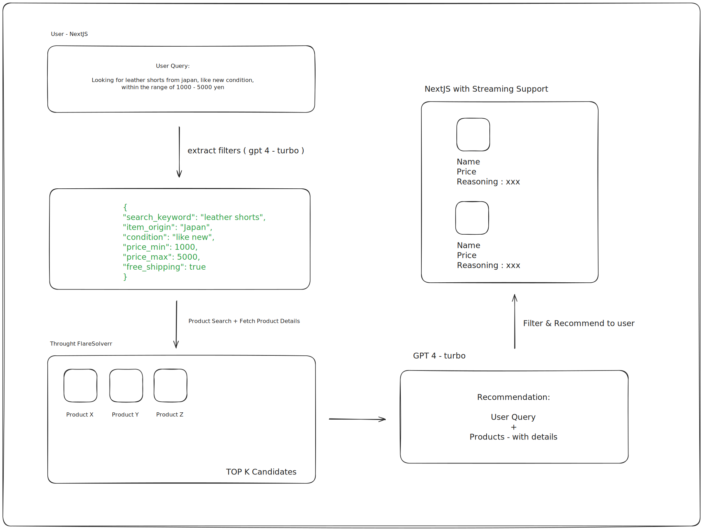

## Overview

This is an AI agent that understand user requests regarding the queries about shopping on Mercari - https://www.mercari.com/ .

And suggest top matching products back to user in a conversational and user-friendly way.

Backend - https://github.com/wailinkyaww/mercari-api
Frontend - https://github.com/wailinkyaww/mercari-client

**Architecture & Flow Diagram**



We have three instances

- frontend (NextJS)
- backend (FastAPI)
- scraping (FlareSolverr)
  with the language model of `gpt4-turbo`.

### Agent Architecture

**Filters Extraction**

We start by understanding user query & extracting filters.
For this step, we have curate a few filters by observing Mercari website.

Here are available filters:

* search keywords
* item origin (Japan / USA / Anywhere)
* item condition
* price range
* free shipping.

  By predefining schema, it will reduce the chance of language model hallucinating into non-existence filters on
  Mercari.

**Product Search Scraping**

Using the filters, we construct the product URL and scrape using FlareSolverr.
We have defined custom logic to map these filters to Mercari's URL spec.

**Product Details Enrichment**

While the results from previous step is good, there's not much information to be used for recommendation.
It only has name, price, status etc.
Therefore, we fetch comprehensive details like description & seller ratings.

**LLM Recommendation**

By looking at all the available information, LLM recommend up to top 3 products to user.

**Other Features**

- We have the conversation support, so that user's can ask follow-up questions.
- We show the progress to user while they are waiting. So that they won't feel stuck.

## Setup Instructions - Backend API

Go inside `mercari-search-ai-agent` - backend server.

Run flaresolverr container using docker compose first.

```shell
# depending on your docker compose installation, run either one of following
docker compose up -d
docker-compose up -d
```

Create virtual env using python. Please use python version `3.11.0`.

```shell
# from the root directory
python -m venv env
source env/bin/activate
```

Install the dependencies.

```shell
pip install -r requirements.txt
```

Create .env file with following values.
Refer to .env.sample for details.

```env
# to access llm - API key should have access to `gpt-4-turbo`
OPENAI_API_KEY=<openai-key>

# to scrape through flare solverr proxy
# Once you spin up the flare solverr with docker compose, it will run at port 8191
FLARESOLVERR_URL=http://localhost:8191/v1
```

Start the FastAPI server.

```shell
# from root directory, run following
uvicorn src:app --workers 1
```

This will run the API server at - http://127.0.0.1:8000

You can run the test cases using

```shell
python -m src.services.tests.test_url
```

## Step Instructions - Frontend

Go inside `mercari-search-ai-agent-client` - frontend app.

We use bun and typescript on frontend.
The web framework is NextJS.

Bun installation - please use bun version `1.1.45`

```shell
# on macOS / linux
curl -fsSL https://bun.sh/install | bash

curl -fsSL https://bun.sh/install | bash -s "bun-v1.1.45"
```

If you have any other OS, please refer to - https://bun.sh/docs/installation
Create `.env` file at the root of directory

```env
# make sure you point to backend API server
NEXT_PUBLIC_API_URL=http://localhost:8000
```

Install packages. Run following command to install it.

```shell
# this will create a node module folder
bun install
```

Run the frontend app.

```shell
bun run dev
```

This will start the frontend client at - http://localhost:3000
You can go to browser and use http://localhost:3000

## Usage Instructions

Once you have

- flaresolverr (docker)
- backend api at (http://localhost:8000)
- frontend app at (http://localhost:3000)

You can go to frontend app and enters your query of interest.
It is pretty straightforward.

Please use chrome to test out.

**Key Points**

- You can see live agent actions on frontend.
- You can ask follow up questions and refer to your previous queries.

Note: Once you refresh, the data will be gone, so please wait it is loading / streaming.

If you encounters any error, just restart the backend API (sometimes, while scraping).
As this is POC, I didn't put make the error handling robust.

Please also refer to attached demo video.

## Design Choices

**Tech Stack**

- FastAPI
- NextJS
- Language Model - `gpt4-turbo`
- Scraping - `flaresolverr` + `requests`

**Fast API**
For this project's purpose, we need something straightforward that can get the job done in short time.
Fast API is a good fit for this. It also has streaming support (to show as the LLM / system produce the tokens &
updates) which is a requirement that I have a mind.

**NextJS**
I wanted to use ReactJS for frontend as it is widely adopted. NextJS - is a battery included framework for ReactJS.

It comes with routing, TypeScript support, Tailwind css etc.,

Chosen this as it is easy to setup and get started.

**Language Model**

I looked into a few candidates

- gpt3.5-turbo, gpt4 and gpt4-turbo
- claude sonnet 3.5
- openai o1

Here is my evaluation strategy.

- text / image support
- speed
- context window

**Visual Language Models & Recommendations**

Initially, I wanted to use Claude Sonnet 3.5 because when we do the product recommendation,
we have name, description, price, seller rating etc along with the product image.

If we o1 or claude sonnet 3.5, we can feed the Product images, which will enhance the recommendation reasoning /
quality.

But due to the time constraint, and the fact that we scrape product details - description, seller rating, categories,
I believe this is comprehensive enough to perform a good recommendation.

Therefore, `o1` and `claude sonnet 3.5` are eliminated as we don't need `Visual Language Models` here.

**OpenAI GPT Family**

I believe product recommendation is something that even `GPT-3.5-turbo` can do very well.

However, the challenges here are that
1. we scraped top 5 products from mercari
2. we let the LLM suggests top 3 that are most relevant to user's query

And we provide the product details to Language model in `JSON` format.
If we are to increase the candidate products list from 5 for e.g., to 10 / 20 products, the input context window size will easily spike up.

Therefore, we look into `gpt4` and `gpt4-turbo`.
As turbo is faster & have 128K context window while GPT4 only have 8K, we simply end up with this `gpt4-turbo`.

**Web Scraping**
Before even choosing any framework `playwright`, `selenium` or native `requests`, 
I played around with mercari website to see how their tech stack is designed.

Evaluation criteria include
1. whether it has server side rendering
2. whether it is doing client side rendering

I noticed mercari is doing client side rendering. Therefore, we can't use `requests` package to perform plain http call.
We need to use browser automation tool so that we can wait for the `DOM Content` to be loaded.

I started with `playwright`, spun up docker container and connect to playwright from FastAPI via websocket.

However, mercari has CloudFlare prevention in front of their web portal. I couldn't extract any information.

To bypass the CloudFlare challenge, I bring in `flaresolverr` - https://github.com/FlareSolverr/FlareSolverr
and checked if we can use playwright with flaresolverr as I already have some implementation around playwright.

We can't use those two together. 
Therefore, I switched to following approach:
- `requests` (talks to flaresolverr)
- `flaresolverr` (proxy that will scrape Mercari and respond back)

I have tested both `products search` page and `product details` page. It works well.

If we are using playwright, I would use CSS query selector syntax to extract the information from the web page.
It is cleaner to use.

However, I migrated away playwright and end up with html string which leads me to use `Beautiful Soup`.

## Potential Improvements

I tried to improve the UI alongside the API to justify the Agent's capabilities.

Here are the potential improvements that I can think of.

1. Error handling - currently the stream will stop midways, we should notify the user with proper error message.
2. Scraping Performance - while getting the product details, we are fetching sequentially. We can spin up multiple
   flaresolverr (crawler) nodes and speed up the scraping.
3. Candidate selections - our approach is we fetch top K of 5 from Mercari first. Then we ask the LLM to come up with
   the recommendation. We can definitely increase this number up to ~10-20 with the speed degradation on the other hand.
   But, this will definitely increase the output quality. This depends on #2 to be able to scale up.
4. Alternatively, we can use `Mercari API` instead of scraping. This will 10x our agent speed. Here is the
   API - https://api.mercari-shops.com/docs/index.html
5. As I mentioned in evaluation section, we can use `Visual Language Models` / Multi models to look at the product
   images while doing the recommendation.